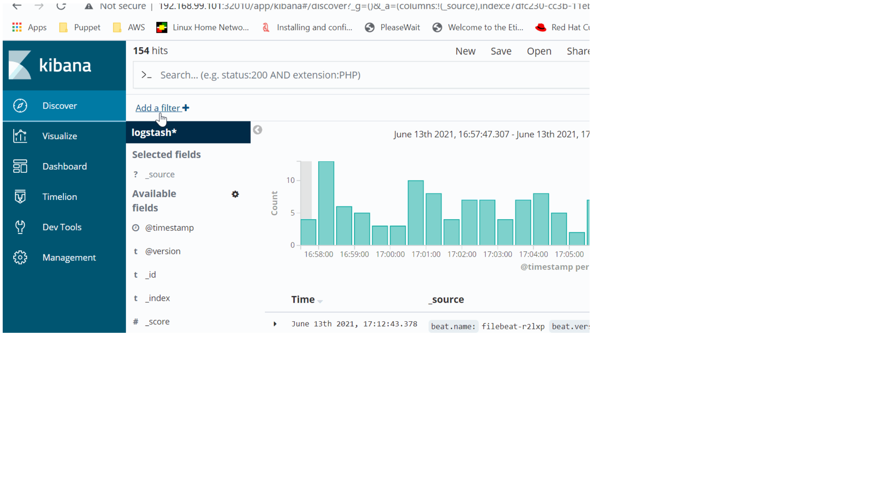

# ELK-Kubernetes
Setup the ELK stack for Kubernetes/microservices  

First thing first, Please clone the repository to download the code locally
```
git clone https://github.com/hussainaphroj/ELK-kubernetes.git  
```
You haven't set up the Kubernetes cluster yet, Please clone my [Kubernetes setup repo](https://github.com/hussainaphroj/kubernetes-cluster-setup) .   

**Note:** This ELK stack has been tested on **minikube** and Kubernetes cluster on **Baremetal**.

The ELK stack is a popular tool for log aggregation and visualization and it stands for **Elastic Logstash Kibana**

The steps used to set up the ELK stack are:  
- We start by creating the Elastic component first but before creating/installing the Elastic, we will create the service account which has read access to service, endpoint and  namespaces using `` kubectl apply -f rbac.yml ``  
- We will setpup the Elastic cluster now, we will create the statefulset using `` kubectl apply -f elastic.yml``  

- Let create the cluster type elastic service using `` kubectl apply -f elastic-service.yml`` and can be verifed by forwading it ports to local ``kubectl port-forward -n kube-system svc/elasticsearch-logging 9200:9200``. Optinally, you can browse (http://localhost:9200)  
That's all for the Elastic cluster, now we will deploy the logstash.  
- Logstash receives the logs and formate them in a way that Elasticsearch understand.  we will deploy the logstash using `` kubectl apply -f logstash-config.yml && kubectl apply -f logstash-deployment.yml ``  

- Once logstash is deployed successfully, we deploy the filebeat agent to ship the logs to Logstash. We will use the **Daemonset** kind of deployment which ensure that a pod will running on each node. It can be deployed using `` kubectl apply -f filebeat-daemon-set.yml ``  
- We have come to our end of the deployment, we will deploy the Kibana now for log visualisation using `` kubectl apply -f kibana.yml``. Please note that I have used the **LoadBalancer** service type but you can use **NodePort** type and use the node IP to access from the browser. Since I have setup all on **Minikube** and get the public ip of LoadBalance using ``minikube service kibana-logging -n kube-system`` .   
It will give a url and you can access it using your favorite browser. Please create a **logstash*** indexer by selecting **@timestamp** 

You can see a lot of data on Kibana after clicking on **Discover** tab.

That's all for the ELK cluster setup. If you want to test it using the application. Lets deploy the web application and visualize the log in Kibana using ``kubectl apply -f web-deployment.yml``.

You can filter the log based on Kubernetes label name and error type.

# Kibana Snap


Finally you have this:http://192.168.49.2:32010/app/kibana#/home?_g=()

 
